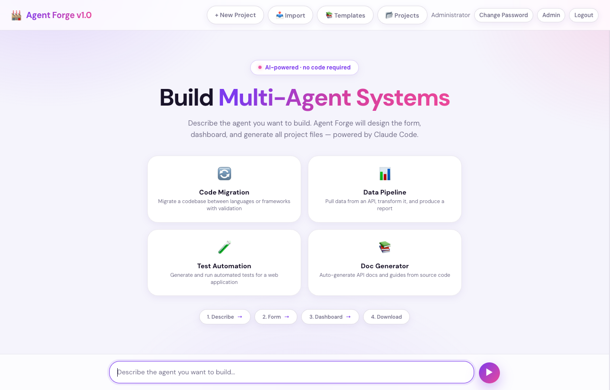
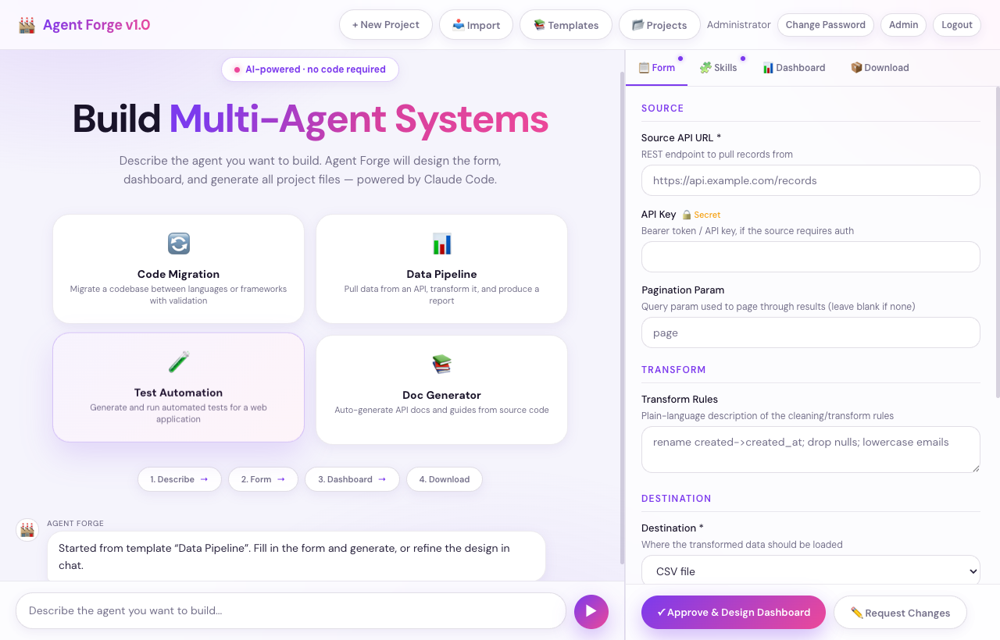
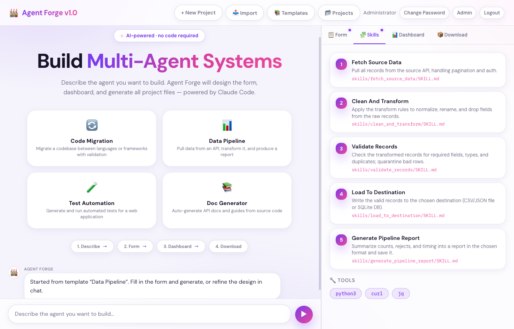
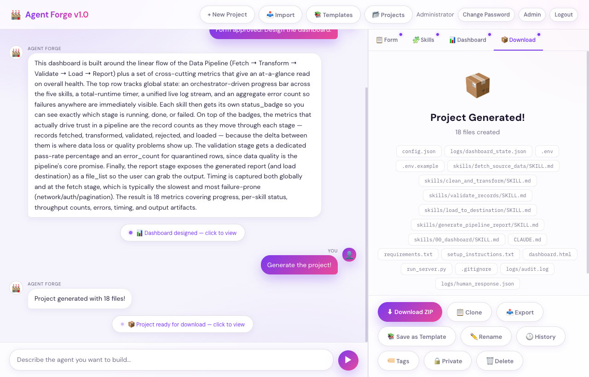
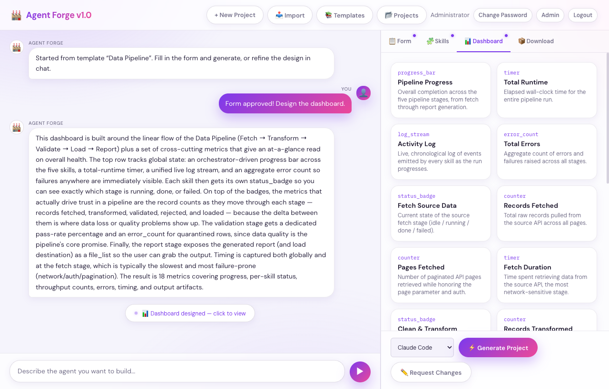
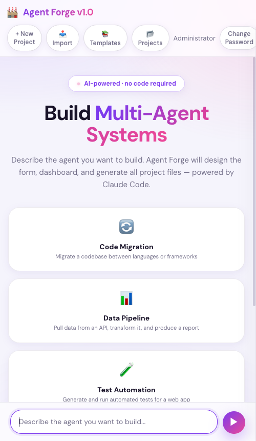
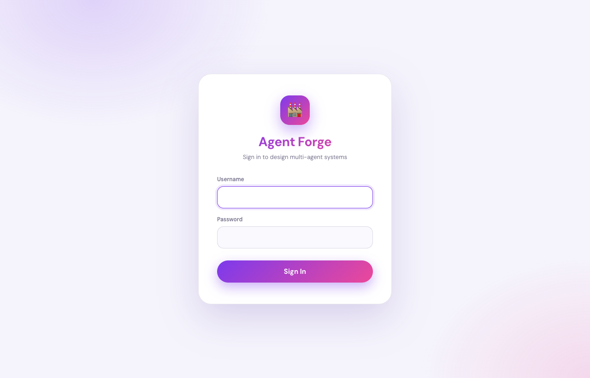

<div align="center">

# 🔨 Agent Forge

### Design & generate production‑ready **multi‑agent systems** from a single sentence — no code.

*Describe what you want → Agent Forge designs the input form, breaks the work into reusable skills, lays out a live dashboard, and generates a complete, runnable project — for **Claude Code, Cursor, Codex, or any AI tool**.*

<br>

[](https://github.com/PradeepKumar1611/agent-forge/actions/workflows/test.yml)


<br>



</div>

---

## ✨ Why Agent Forge?

Hand‑building a multi‑agent system means writing an entry file, deeply detailed per‑skill instructions, a monitoring dashboard, config & secret handling, and error‑recovery loops — **hours of boilerplate per project.**

Agent Forge turns that into a **3‑minute conversation**: you describe the goal in plain English, refine the design in chat if you like, click *Generate*, and download a self‑contained project that an AI agent can execute end‑to‑end.

> _"Build an agent that pulls data from a REST API, cleans and validates it, loads it into a database, and emails a summary report."_ → a 5‑skill pipeline with a config form, live dashboard, and runnable instruction files. ✅ (verified running under **Codex** and **Claude Code**.)

---

## 🎬 How it works

<table>
<tr>
<td width="50%" valign="top">

### 1 · Describe
Type what you want in plain English (or start from a template). Agent Forge asks Claude to design the whole system.

### 2 · Fill the form
It auto‑generates exactly the inputs your agent needs — URLs, paths, options — with **secrets flagged** 🔒 and grouped sensibly.

</td>
<td width="50%" valign="top">



</td>
</tr>
<tr>
<td width="50%" valign="top">



</td>
<td width="50%" valign="top">

### 3 · Review skills & dashboard
The work is decomposed into **as many independent, reusable skills as the job needs** — and a live monitoring dashboard is designed around them.

</td>
</tr>
<tr>
<td width="50%" valign="top">

### 4 · Generate & download
Each skill is generated as a deeply detailed instruction file (concurrently, with a quality gate), then bundled into a downloadable, ready‑to‑run project.

</td>
<td width="50%" valign="top">



</td>
</tr>
</table>

<div align="center">

#### Real‑time, not fake — live per‑skill progress while it builds


</div>

---

## 🚀 Quickstart

**Prerequisites**
- **Python 3.9+**
- **[Claude Code CLI](https://docs.anthropic.com/en/docs/claude-code)** available as `claude` on your `PATH` (this is what designs & generates)

```bash
# 1. Clone
git clone https://github.com/PradeepKumar1611/agent-forge.git
cd agent-forge

# 2. Set up a virtualenv + deps
python3 -m venv venv && source venv/bin/activate
pip install -r requirements.txt

# 3. Configure (optional — sensible defaults exist)
cp .env.example .env        # set ADMIN_PASSWORD / FLASK_SECRET_KEY

# 4. Run  (PORT is configurable; 5000 clashes with AirPlay on macOS)
PORT=5001 python3 server.py
```

Open **http://localhost:5001** → log in (`admin` / your `ADMIN_PASSWORD`, default `admin123`) → start describing.

---

## 🧩 Features

| | |
|---|---|
| 🗣️ **Describe‑to‑build** | Plain‑English → a full multi‑agent design (form + skills + dashboard). Refine it conversationally in chat. |
| 🧠 **Dynamic skill count** | Decomposes into *as many* skills as the work genuinely needs — no artificial caps. |
| ⚡ **Concurrent, quality‑gated generation** | Each skill is generated in its own focused call (in parallel), validated for completeness, and retried if thin. |
| ⏱️ **Real‑time progress** | Long operations run as async jobs with a **live progress + log stream** — no fake spinners. |
| 🎯 **Multi‑platform output** | One design → entry file for **Claude Code**, **Cursor**, **Codex**, or **generic** AI tools. |
| 📚 **Starter templates** | Use built‑in templates or save any project as a reusable template. |
| 🕑 **Versioning** | Every refinement is snapshotted — restore a previous design anytime. |
| 🔄 **Per‑skill regeneration** | Re‑roll a single skill without rebuilding the whole project. |
| 🩺 **Self‑healing output** | Generated projects ship with a **RALPH** retry loop (Read‑Analyze‑List‑Pick‑Halt) and human‑intervention escalation. |
| 🔐 **Secure by default** | Per‑user project isolation, bcrypt password hashing, hardened sessions, secrets kept out of API responses & git. |
| 👥 **Multi‑user + admin** | Accounts, roles, public/private projects, and an activity log. |

### Multi‑platform output

| Platform | Entry file generated | Launch |
|----------|----------------------|--------|
| **Claude Code** | `CLAUDE.md` | `claude --dangerously-skip-permissions "Read CLAUDE.md …"` |
| **Cursor** | `.cursorrules` | Open the folder in Cursor |
| **Codex / OpenAI** | `AGENTS.md` | `codex exec --sandbox workspace-write "Read AGENTS.md …"` |
| **Generic (any AI)** | `INSTRUCTIONS.md` | Paste into your tool of choice |

---

## 📦 What a generated project contains

```
my_agent/
├── CLAUDE.md / AGENTS.md / …   # platform entry point (master instructions)
├── config.json                 # user configuration (paths, URLs, options)
├── .env / .env.example         # secrets (gitignored)
├── skills/
│   ├── 00_dashboard/SKILL.md    # shared dashboard‑state protocol
│   └── <skill>/SKILL.md         # one deeply detailed file per skill
├── dashboard.html               # live progress dashboard
├── run_server.py                # dashboard server (config + report + state)
├── requirements.txt
├── setup_instructions.txt       # platform‑aware run steps
└── logs/dashboard_state.json    # real‑time state the dashboard polls
```

Every skill follows a **shared data contract** (canonical paths, a flat state schema, and `artifacts/` handoff files) so the independently‑generated skills interoperate cleanly at runtime.

---

## 🏗️ Architecture

A small, modular Flask backend with a dependency‑free vanilla‑JS frontend.

| File | Role |
|------|------|
| `server.py` | Routes — auth, project CRUD, describe/chat/dashboard/**generate**, async jobs, templates, versions, download |
| `generator.py` | The engine — turns a project spec into a full, runnable multi‑agent project (per‑skill generation, scaffolding) |
| `jobs.py` | In‑process async job registry (worker threads, live progress/log/status) |
| `claude_client.py` | Wraps the `claude` CLI |
| `database.py` | SQLite store (project = JSON blob; WAL mode) |
| `auth.py` | Users, bcrypt hashing (+ legacy migration), roles, activity log |
| `security.py` | Input filtering, prompt‑injection & path‑traversal guards, secret masking |
| `templates/` | `index.html` (app), `login.html`, `admin.html` |

---

## ⚙️ Configuration

All optional — set in `.env` or the environment.

| Variable | Default | Purpose |
|----------|---------|---------|
| `PORT` | `5000` | Server port (use `5001` on macOS to avoid AirPlay). |
| `ADMIN_PASSWORD` | `admin123` | Password for the default `admin` on first run. |
| `FLASK_SECRET_KEY` | auto | Session signing key (set to persist sessions across restarts). |
| `FLASK_DEBUG` | `false` | Set `true` only for local debugging (never in prod). |
| `SESSION_COOKIE_SECURE` | `false` | Set `true` behind HTTPS. |
| `AGENT_FACTORY_GEN_MODEL` | CLI default | Override the model used to generate skill files. |
| `AGENT_FACTORY_GEN_CONCURRENCY` | `4` | How many skills to generate in parallel. |

---

## 🧪 Quality

- **38 tests** (`pytest`) — auth & bcrypt migration, DB ownership filtering, security guards, **route‑level authorization**, async‑job lifecycle, features, and a generator output regression guard.
- **`ruff`** linting, **GitHub Actions CI** on Python **3.9 & 3.12**.

```bash
python -m pytest -q     # run the suite
ruff check .            # lint
```

---

## 📱 Responsive · 🔐 Secure

<table>
<tr>
<td width="38%" valign="top" align="center">

<br><sub>Fully responsive — cards stack, nav wraps, fluid hero.</sub>
</td>
<td width="62%" valign="top">

- **Project isolation** — users only access their own (or public) projects; every by‑id route enforces ownership.
- **bcrypt** password hashing with transparent migration from legacy hashes.
- **Hardened sessions** (`HttpOnly`, `SameSite`, optional `Secure`).
- **Secrets never leave the box** — stripped from API responses; `.env`, `users.json`, the DB, and generated projects are all gitignored.
- **Guardrails** against prompt injection, recon, and path traversal on user input.

<br>


</td>
</tr>
</table>

---

## 🤝 Contributing

Issues and PRs welcome. Run `pytest` and `ruff check .` before opening a PR — CI runs both on 3.9 and 3.12.

## 📄 License

No license file yet — add one (MIT is a great default) to make reuse terms explicit.

<div align="center">
<br>
<sub>Built with ❤️ and <a href="https://claude.com/claude-code">Claude Code</a> · ✨ <em>describe it, forge it, ship it</em></sub>
</div>
